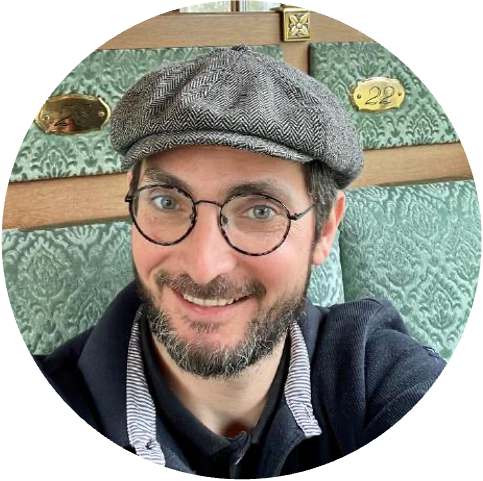

Welcome to my little collection of cheat sheets / overviews / summaries in bioinformatics and related fields
===========================

## Wo I am?

Jacques Dainat
  

*  [Juke34](https://github.com/Juke34)
*  [@JacquesDainat](https://twitter.com/JacquesDainat)
*  [ResearchGate](https://www.researchgate.net/profile/Jacques-Dainat-2)
*  [https://orcid.org/0000-0002-6629-0173](https://orcid.org/0000-0002-6629-0173)
*  [@jacquesdainat@genomic.social](https://genomic.social/@jacquesdainat)
*  [in/jacques-dainat-02257376](https://www.linkedin.com/in/jacques-dainat-02257376/)

I studied Bioinformatics at the Science University of Montpellier (France), and obtained a Phd in Bioinformatics, Structural biochemistry and Genomics at the Marseille University (France). During my Phd I focused on the analysis and the detection of unitary pseudogenes in eukaryotes. For this purpose, I developed expert system modules that generate and analyse heterogeneous data (e.g phylogenetic trees, protein predictions, sequence ancestral reconstructions, sequence comparisons, parsimony reconstruction of events, etc.). This approach allowing detecting loss and pseudogenization events occurred during evolution and also detecting intact genes not yet annotated (see [here](https://journals.plos.org/plosone/article?id=10.1371/journal.pone.0038792) and [here](https://link.springer.com/chapter/10.1007/978-3-642-20763-1_5). I was equally involved in the creation and analysis of phylome of the chordata proteome ([see here](https://journals.sagepub.com/doi/10.4137/EBO.S9186)).  

The year after my PhD I was PostDoc at The French National Institute of Higher Education in Agricultural Sciences. My work focused on the detection of positive selection at large scale among angiosperm genomes thanks to an original method. The aim was to study the impact of recurrent gene duplication on adaptation of plant genomes ([see here](https://bmcplantbiol.biomedcentral.com/articles/10.1186/1471-2229-14-151)). I also worked on the highlight of the species tree of Triticeae ([see here](https://www.science.org/doi/10.1126/sciadv.aav9188)).  

I choose to move to Sweden to join NBIS in 2014 as expert in genome annotation. I was performing functional and structural gene annotation in genomes of any type of organisms (e.g. plants, animals, fungi, bacteria) and many other surrounded tasks like genome assembly, transcriptome assembly, abinitio training, manual curation, data submission, cluster administration, etc. A large part of my time was dedicated to the development of tools and pipelines ([AGAT](https://github.com/NBISweden/AGAT), [EMBLmyGFF3](https://github.com/NBISweden/EMBLmyGFF3), [GUESSmyLT](https://github.com/NBISweden/GUESSmyLT), etc.). I was also involved in NBIS training activities in Sweden. As part of Elixir I also have teached Genome Annotation and Assembly in different European coutries.  

In 2020 I moved back to France in Montpellier to join Alcediag in the CNRS-ALCEDIAG joint research unit. Alcediag is a precision diagnostics company focusing primarily on mental health, which uses epitranscriptomics analysis. We develops and commercialises blood-based diagnostic solutions for mental health. I have been part of the development of [EDIT-B/myEDIT-B](https://www.alcediag-alcen.com/products-services/edit-b/) a diagnostic blood test to differentiate between depression and bipolar disorder.  

In 2023 I decided to join the French National Research Institute for Sustainable Development (IRD) still in Montpellier, to be a driving force in the [MIVEGEC](https://mivegec.fr/en) unit's bioinformatics transition. There I'm part of the bioinformatics platform [iTrop](https://bioinfo.ird.fr/index.php/en/front-page-2/) and also implied in the [Southgreen](https://www.southgreen.fr) platform.

A along this time I've been involved in a number of interesting projects and communities [bioconda](http://bioconda.github.io), [BeeBiome consortium](BeeBiome-consortium), [biostarts](https://www.biostars.org), etc.  
