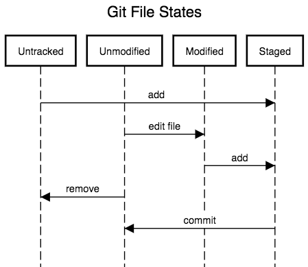

# The GIT version-control system

Most of the documention find here is inspired or copied from the excellent ressources provided by the CodeRefinery project ([Here an example of such workshop in Uppsala december 2018](https://coderefinery.org/workshops/2018-12-03-uppsala/)). CodeRefinery is a project within the [Nordic e-Infrastructure Collaboration](https://neic.no) (NeIC). NeIC is an organisational unit under [NordForsk](https://www.nordforsk.org/en).

### [Basics](https://coderefinery.github.io/git-intro/03-basics/)

| Command | Comment
| --- | --- 
| git init    | initialize new repository
| git add     | add files or stage file(s)
| git commit  | commit staged file(s)
| git status  | see what is going on
| git log     | see history
| git log --oneline |  to get a better log of your commits history
| git diff    | show unstaged/uncommitted modifications
| git show    | show the change for a specific commit
| git mv      | move tracked files
| git rm      | remove tracked files

### [Undoing things](https://coderefinery.github.io/git-intro/05-undoing/)

| Command | Comment |
| --- | --- |
| git revert f960dd3 | This creates a new commit that does the opposite of the reverted commit. The old commit remains in the history |
| git commit --amend | Amend to the last commit. This can also be used to modify the last commit message. Note that this will change the commit hash. This command modifies the history. This means that we never use this command on commits that we have shared with others. |
| git checkout \<filename\> | Undo unstaged/uncommitted changes. |

### [The staging area](https://coderefinery.github.io/git-intro/06-staging-area/)

The staging area helps us to create well-defined commits.

| Command | Comment
| --- | --- 
| git diff    | show unstaged/uncommitted modifications
| git diff --staged |   see **staged** changes
| git reset   | unstages staged changes
| git checkout \<path\>  | check out the latest staged version ( or committed version if file has not been staged )
| git add -u | stage all modification

### [Aliases](https://coderefinery.github.io/git-intro/07-aliases/)

| Command | Comment
| --- | --- 
git config --global alias.graph "log --all --graph --decorate --oneline" | the command "log --all --graph --decorate --oneline" can now be called using **git graph** 

### [Branching and merging](https://coderefinery.github.io/git-intro/09-branches/)

| Command | Comment
| --- | --- 
| git branch               | see where we are
| git branch \<name\>        | create branch \<name\>
| git checkout \<name\>      | switch to branch \<name\>
| git merge \<name\>         | merge branch \<name\> (to current branch)
| git branch -d \<name\>     | delete branch \<name\>
| git branch -D \<name\>     | delete unmerged branch
| git checkout -b \<name\>   | create branch \<name\> and switch to it
| git reset --hard \<branch/hash\>  | rewind current branch to \<branch/hash\> and throw away all later code changes
| git reset --soft \<branch/hash\>  | rewind current branch to \<branch/hash\> but keep all later code changes and stage them
| git rebase \<branch/hash\>        | cut current branch off and transplant it on top of \<branch/hash\>
| git reflog                      | show me a log of past hashes I have visited
| git checkout -b \<branch/hash\>   | create a branch pointing to <bran

  * Typical workflows
	
With this there are two typical workflows:

		$ git checkout -b new-feature  # create branch, switch to it
		$ git commit                   # work, work, work, ...
					       # test
					       # feature is ready
		$ git checkout master          # switch to master
		$ git merge new-feature        # merge work to master
		$ git branch -d new-feature    # remove branch

Sometimes you have a wild idea which does not work. Or you want some throw-away branch for debugging:

		$ git checkout -b wild-idea
					       # work, work, work, ...
					       # realize it was a bad idea
		$ git checkout master
		$ git branch -D wild-idea      # it is gone, off to a new idea
					       # -D because we never merged back

No problem: we worked on a branch, branch is deleted, master is clean.

[**Rebase vs. merge**](https://coderefinery.github.io/git-branch-design/01-rebase/) 
[**Git rebase and commit squashing**](https://coderefinery.github.io/git-branch-design/03-squashing-exercise/)

### Tagging

| Command | Comment
| --- | --- 
| git **tag** -a v1.0 -m "message" |  To record particular states or milestones of a project at a given point in time, like for instance versions.
| git push origin \<tagname\> | To push a tag to remote servers.
| git push --delete origin \<tagname\> | To delete the remote tag.
| git tag --delete \<tagname\> | To delete the local tag.

### [Conflict resolution](https://coderefinery.github.io/git-intro/10-conflicts/)

See the link for manual resolution.

| Command | Comment
| --- | --- 
| git merge -s recursive -Xours branch-name | merge and in doubt take the changes from current branch
| git merge -s recursive -Xtheirs branch-name | merge and in doubt take the changes from less-avocados branch
| git merge --abort | Abort a conflicting merge

### [Interrupted work](https://coderefinery.github.io/git-intro/12-interrupted/)

You are in a middle of a development and a colleague wants to fix/commit something right now. How to do ?
  * Stashing
  The stash is the first and easiest place to temporarily “stash” things. The stashes form a stack, so you can stash several batches of modifications.

| Command | Comment
| --- | --- 
| git stash | will put working directory and staging area changes away. Your code will be same as last commit.
| git stash pop | will return to the state you were before. Can give it a list.
| git stash list | will list the current stashes.
| git stash save NAME | is like the first, but will give it a name. Useful if it might last a while.
| git stash save [-p] [filename] | will stash certain files files and/or by patches.
| git stash drop | will drop the most recent stash (or whichever stash you give).
| git stash apply | reapply the work from the most recent stash
| git stash apply stash@{2} | reapply the work from a specific stash

  * Create branches

		git checkout -b temporary  # create a branch and switch to it
		git add <paths>            # stage changes
		git commit                 # commit them
		git checkout master        # back to master
					     # do your work...
		git checkout temporary     # continue where you left off

### Working with remotes

| Command | Comment
| --- | --- 
| git clone https://host.com/user/project.git project | cloning a repository
| git push origin master | push the change to the upstream repository
| git pull origin master | Pull updates from the upstream repository (It is equivalent to `git fetch origin` + `git merge origin/master`)
| git pull --rebase origin master | alternative to avoid merge commits
| git push origin -u branchName | Push your change as a new branch branchName
| git push origin somefeature | push to the remote branch somefeature
| git pull origin somefeature  | pull to the remote branch somefeature
| git push origin --delete somefeature | delete the remote branch somefeature

### [Git archaeology](https://coderefinery.github.io/git-archaeology/)

| Command | Comment
| --- | --- |
| git diff HEAD^^ HEAD \<filename\> | to see the difference for a file \<filename\> between now and two commits back
| git diff 61a86561a1edb438963f5f22ec9e0773a0c4aacf HEAD \<filename\> | to see the difference for a file \<filename\> between now and a specific commit
| git show e83c51633 | Inspecting commit e83c51633
| git grep -i __term__ | Greps entire repository below current directory
| git blame \<filename\> | Show what revision and author last modified each line of a file.
| git log --oneline --grep "__term__" | grepping commit messages
| git log -S '__term__' \<filename\> | Finding removed code (__term__) from file \<filename\>
| git checkout -b \<name\> \<hash\> | Branch from arbitrary (earlier) hash. Recommended mechanism to inspect old code. remove the | branch once you found what you were looking for.
| git shortlog --summary --numbered | To show all users and the number of commits

  * bisect
  
		$ git bisect start
		$ git bisect good 89578ed  # this is a commit that worked
		$ git bisect bad HEAD      # last commit is broken
		  # now compile and/or run
		  # after that decide whether
		$ git bisect good
		  # or
		$ git bisect bad
		  # now compile and/or run
		  # after that decide whether
		$ git bisect good
		  # or
		$ git bisect bad
		  # iterate until commit is found

This can even be automatized with `git bisect run <script>`. For this you write a script that returns zero/non-zero (success/failure).

### [Cherry Picking](https://www.previousnext.com.au/blog/intro-cherry-picking-git)

**When?**  
Let’s say you are working in an project where you are making changes in a branch called `new-features`. You have already made a few commits but want to move just one of them into the master branch.

**How?**  
  * Checkout the branch where you want to cherry pick the specific commits (`git checkout branchName`)
  * Cherry pick from `new-features branch` (`git cherry-pick __commit-id__`)

| Command | Comment
| --- | --- 
| git cherry-pick __commit-hash__ | cherry pick the commit with hash __commit-hash__
| git cherry-pick __commit-hash1__ __commit-hash2__ | cherry pick several commits
| git cherry-pick --continue | When the cherry picking stoped by a conflicts and you have resolved it, then launch this command
| git cherry-pick --abort | Cancel the operation and return to the pre-sequence state
| git cherry-pick -m 1 \<hash\> | herry pick a merge instead of a commit

**/!\\** Cherry picking is commonly discouraged in developer community. The main reason is because it creates a duplicate commit with the same changes and you lose the ability to track the history of the original commit. If you can merge, then you should use that instead of cherry picking. Use it with caution!

### Extra

[Git branch design lesson](https://coderefinery.github.io/git-branch-design/)
